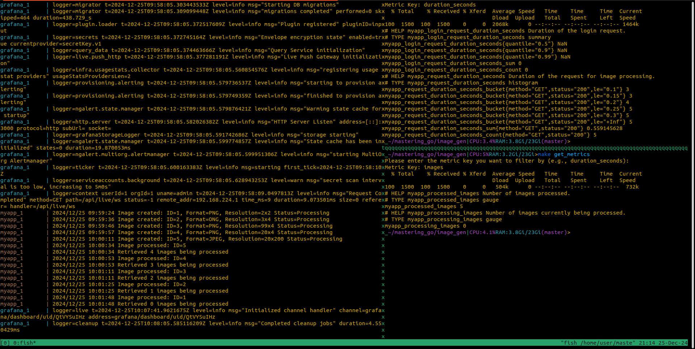
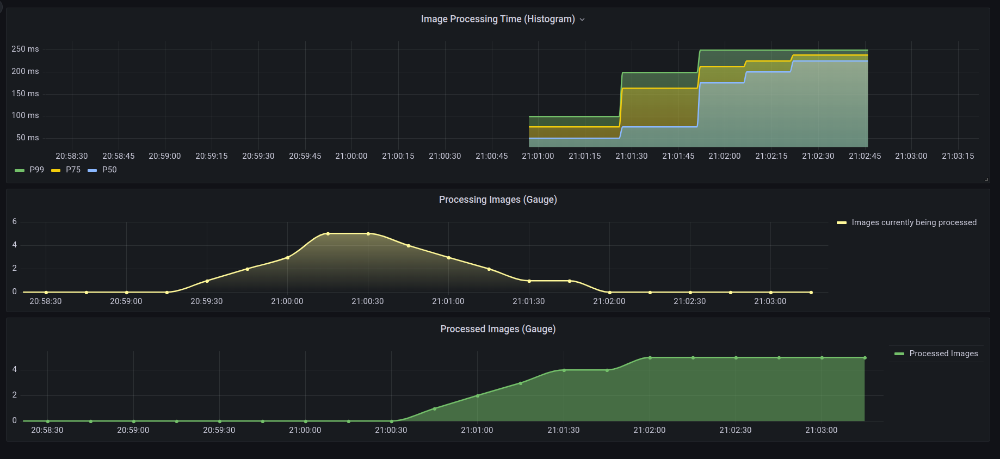
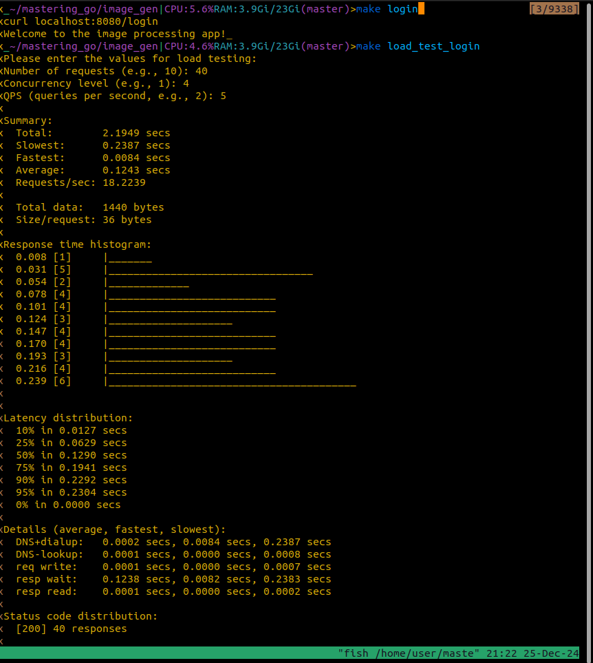
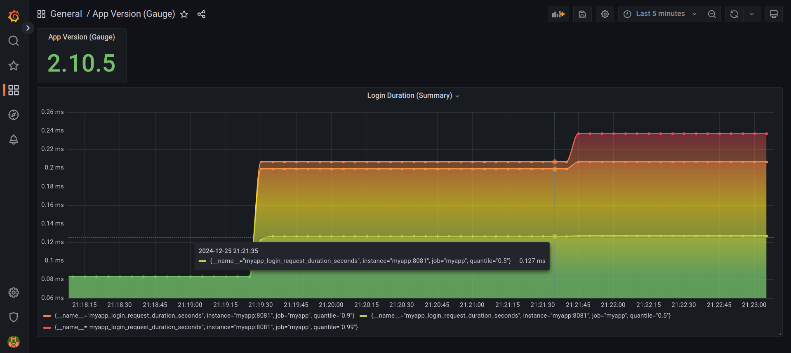

# Image Processing Application

## Overview

This project is an image processing system with robust monitoring capabilities. It uses Docker to manage its services and integrates Prometheus and Grafana for real-time metrics visualization. The system is designed to:

- Visualize Image Processing Statistics at Scale.
- Expose APIs for image creation, retrieval, and status updates.
- Monitor key metrics like request durations, processed image counts, and login durations.
- Simulate login operations and test their performance under various loads.

## Overview of Graph Measurements in Grafana

Grafana visualizes various metrics through different types of measurements. Here’s a brief description of the core types used in this application:

### 1. **Counter**

- **Definition**: A Counter is a cumulative metric that can only increase over time. It is typically used for counting events or occurrences, such as the total number of images processed.
  
### 2. **Gauge**

- **Definition**: A Gauge is a metric that can go up and down, representing a current value at any given time. It is used for measurements that fluctuate, such as the current size of a processing queue or the number of images being processed.

### 3. **Summary**

- **Definition**: A Summary tracks the distribution of values over time, such as the duration of requests. It provides a statistical summary of observed data, typically including quantiles like the median, 95th percentile, etc.

### 4. **Histogram**

- **Definition**: A Histogram is similar to a Summary but it groups observations into predefined buckets (ranges) for more granular control over distribution analysis. It can track the frequency of observed values within certain intervals.

## Features

- **Image Management APIs**:
  - `/images`: Create and retrieve image data.
  - `/images/{id}`: Update the processing status of an image.
  - `/login`: Simulate a user login.
- **Monitoring and Metrics**:
  - Metrics are exposed at `/metrics` on port `8081`.
  - Prometheus collects metrics, which can be visualized in Grafana.
- **Load Testing**:
  - Tools like `hey` simulate and analyze performance under heavy loads.

## Prerequisites

1. Install Docker and Docker Compose.
2. Install `curl` and `hey` for making HTTP requests and load testing.

## Getting Started

### 1. Clone the Repository

```bash
git clone <repository-url>
cd <repository-url>
```

### 2. Start the Application

Build and start the application using Docker Compose:

```bash
make up
```

This will:

- Build the application image.
- Start the application and related services (Prometheus and Grafana).

### 3. Stop the Application

To shut down the application and clean up resources:

```bash
make down
```

## Testing the Application

### 1. Create an Image

Run the following command to create a new image:

```bash
make create_image
```

Follow the prompts to input the image details (e.g., ID, format, resolution). This sends a POST request to `/images` and registers the image with a "Processing" status.

### 2. Update Image Status

To mark an image as processed:

```bash
make process_image
```

Provide the ID of the image to update. This sends a PUT request to `/images/{id}`. The command also retrieves the updated list of images.

### 3. Check Metrics

To view application metrics, use:

```bash
make get_metrics
```

Provide a metric key (e.g., `request_duration_seconds` or `images`) to filter relevant metrics. Example:

#### Output Example -

```plaintext
# HELP myapp_processed_images Number of images processed.
# TYPE myapp_processed_images gauge
myapp_processed_images 5
# HELP myapp_processing_images Number of images currently being processed.
# TYPE myapp_processing_images gauge
myapp_processing_images 0
```

Explanation:

- **`myapp_processed_images`**: Total number of images successfully processed.
- **`myapp_processing_images`**: Number of images currently in the processing state.

### 4. Simulate a Login Request

To simulate a user login:

```bash
make login
```

Example Output:

```plaintext
Welcome to the image processing app!
```

### 5. Load Test the Login Endpoint

Run load tests to analyze login performance under stress:

```bash
make load_test_login
```

Provide the number of requests, concurrency level, and queries per second (QPS). Example:

#### Input-

- **Number of requests**: 40
- **Concurrency level**: 4
- **QPS**: 5

#### Output Example-

```plaintext
Summary:
  Total:        2.1949 secs
  Slowest:      0.2387 secs
  Fastest:      0.0084 secs
  Average:      0.1243 secs
  Requests/sec: 18.2239

Latency distribution:
  10% in 0.0127 secs
  25% in 0.0629 secs
  50% in 0.1290 secs
  75% in 0.1941 secs
  90% in 0.2292 secs
  95% in 0.2304 secs
```

**Explanation:**

- **Total Time**: Total duration for all requests to complete.
- **Fastest & Slowest**: Minimum and maximum response times.
- **Requests/sec**: Number of requests processed per second.
- **Latency Distribution**: Percentage of requests completed within specific time ranges.

### 6. Clean Up

To stop all services and clean up resources:

```bash
make clean
```

## Additional Notes

- Grafana dashboard is accessible at `http://localhost:3000` (default credentials can be set in docker-compose).
- Prometheus metrics can be viewed at `http://localhost:8081/metrics`.

## Output

### Adding and Processing 5 images-



### Key Components of the Output

1. **Buckets (`myapp_request_duration_seconds_bucket`)**:
   - Histograms in Prometheus divide observed data into predefined buckets. Each bucket shows how many requests were completed in less than or equal to a specific duration.
   - The labels `method="GET"` and `status="200"` indicate that this metric is tracking only successful `GET` requests.
   - **Example**:
     - `le="0.1"`: 3 requests were completed in ≤ 0.1 seconds.
     - `le="0.15"`: 3 requests were completed in ≤ 0.15 seconds.
     - `le="0.2"`: 4 requests were completed in ≤ 0.2 seconds.
     - `le="0.25"`: 5 requests were completed in ≤ 0.25 seconds.
     - `le="0.3"`: 5 requests were completed in ≤ 0.3 seconds.
     - `le="+Inf"`: 5 requests were completed in total (regardless of duration).

2. **Sum (`myapp_request_duration_seconds_sum`)**:
   - The total time taken by all `5` requests combined is `0.5591` seconds.

3. **Count (`myapp_request_duration_seconds_count`)**:
   - A total of `5` requests were observed.

### Output on Grafana-



### Login to application-



### Load testing on the login request-



This application provides a flexible and scalable way to manage images while monitoring its performance effectively.
